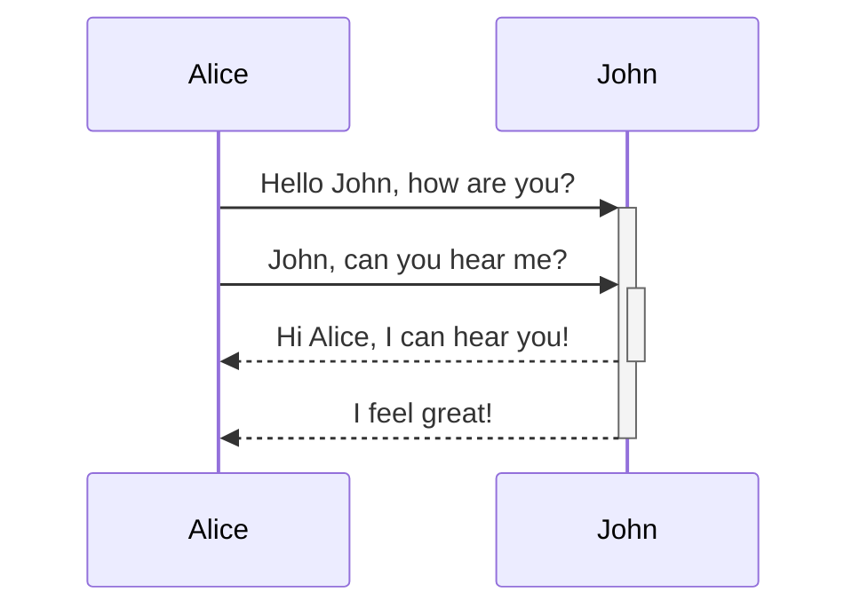
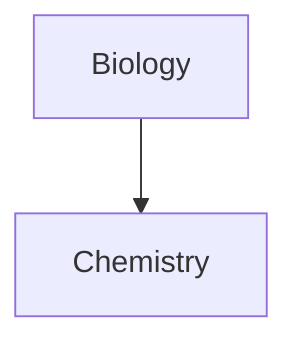

|First Header | Second Header|
|------------- | ------------|
|Content from cell 1 | Content from cell 2|
|Content in the first column | Content in the second colmumn|

Tables can be justified with a colon | Another example with a long title | And another long title as a example
:----------------|-------------:|:-------------:
because of the `:` | these will be justified |this is centered

Use two equal signs to ==highlight text==

***
---
___

%%
Block Comment - cannot be seen in Reading Mode
%%

Diagrams!

For more:
https://help.obsidian.md/How+to/Format+your+notes

